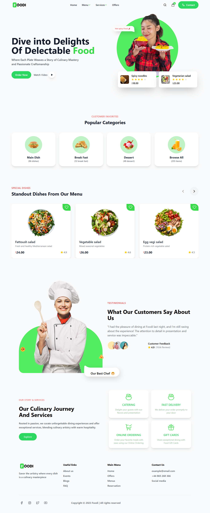

# Restaurant Landing Page - React.js Implementation

This project is a **React.js** implementation of a restaurant landing page based on the provided Figma design reference.

---




## Reference Design

The landing page is developed to replicate the Figma design with high fidelity, ensuring consistency with the provided layout, color scheme, and typography.

### Features
- **Fully Responsive:** The design adapts seamlessly to various screen sizes.
- **Pixel-Perfect Layout:** Matches the Figma design specifications.
- **Interactive UI:** Focus on user engagement and a smooth browsing experience.
- **Modern Styling:** Leveraging **Tailwind CSS** for clean and efficient styling.

---

## Technologies Used
- **React.js** for building the user interface.
- **Tailwind CSS** for responsive and modern design styling.
- **React Icons** for consistent iconography.

---

## Setup Instructions

### Prerequisites
- **Node.js** installed on your system.
- A package manager like **npm** or **yarn**.

### Steps to Run the Project

1. Clone the repository:
   ```bash
   git clone https://github.com/shivasingh0/mx-task2.git
   ```


2. Navigate into the project directory:
   ```bash
   cd mx-task2
   ```

3. Install the dependencies:
   ```bash
   npm install
   # or
   yarn install
   ```

4. Start the development server:
   ```bash
   npm start
   # or
   yarn start
   ```

5. Open your browser and visit `http://localhost:3000` to view the landing page.

